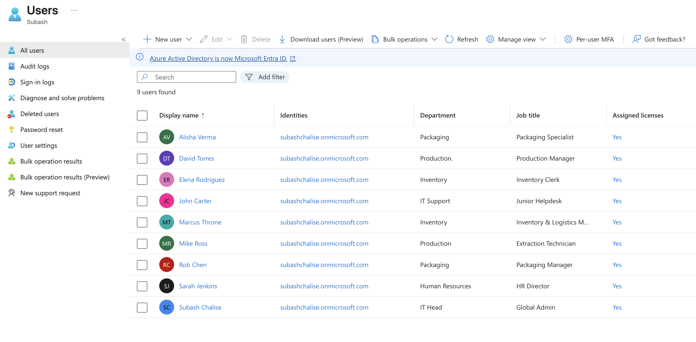
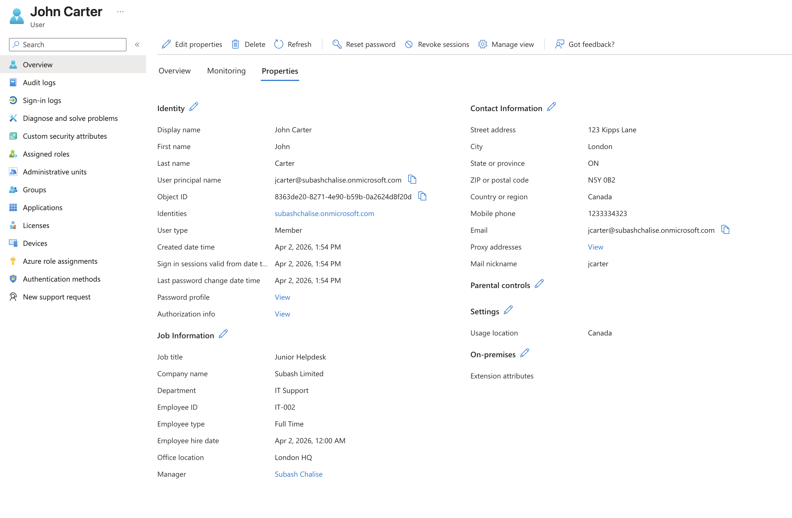
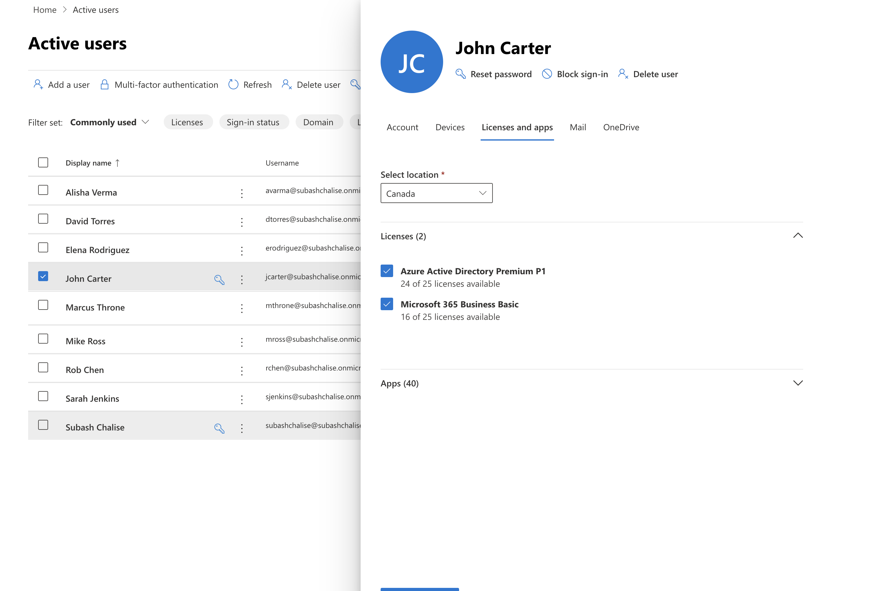
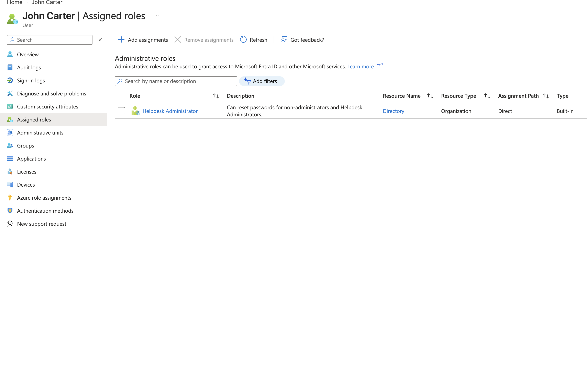
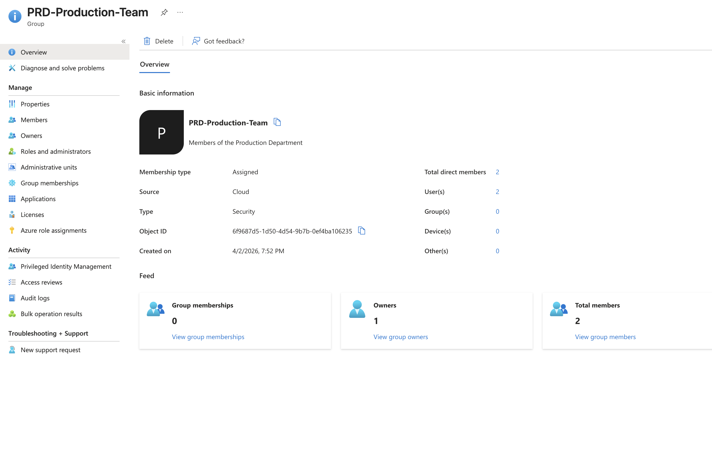
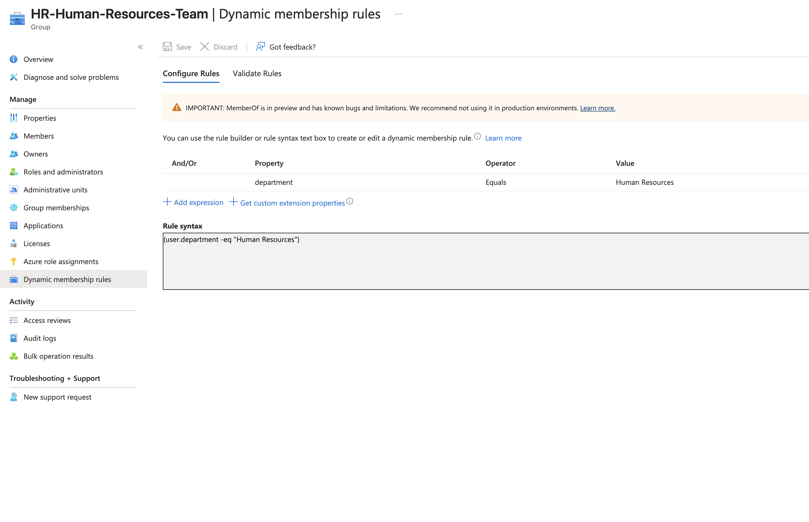
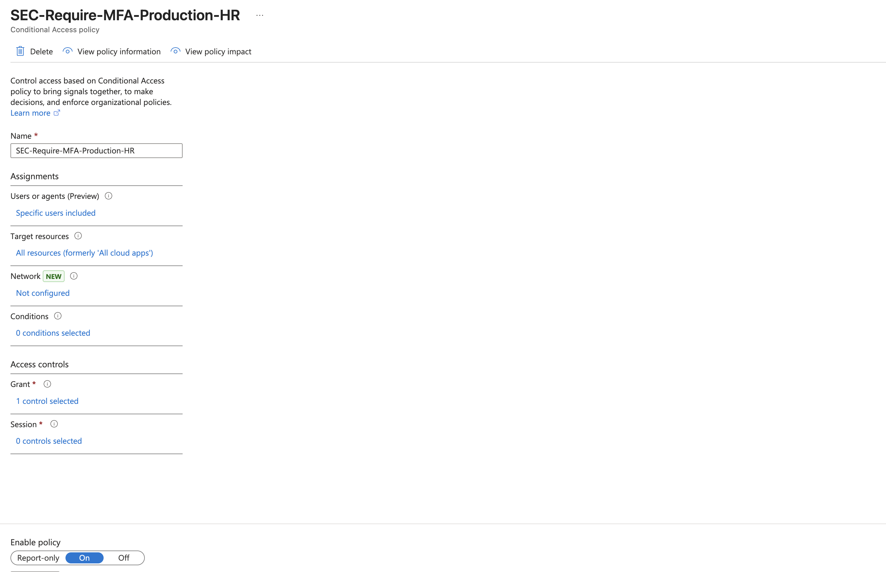
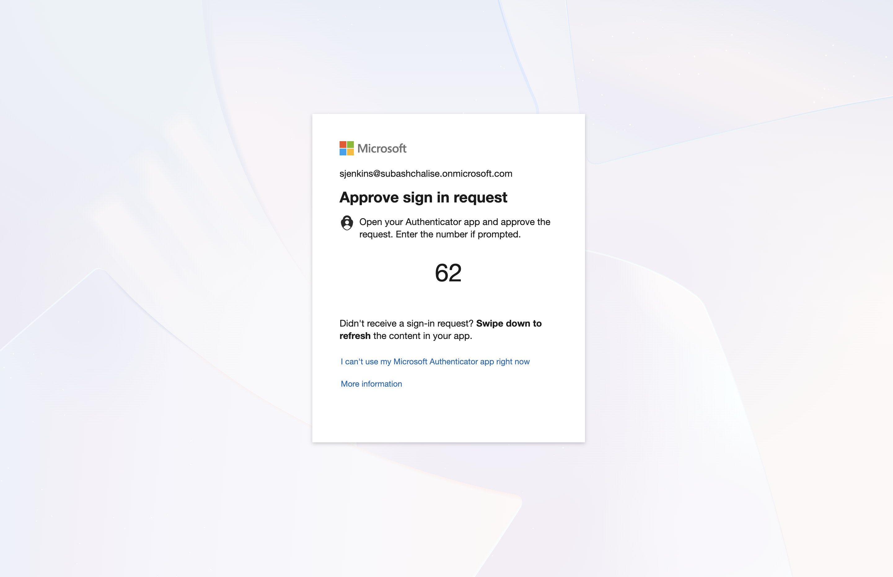
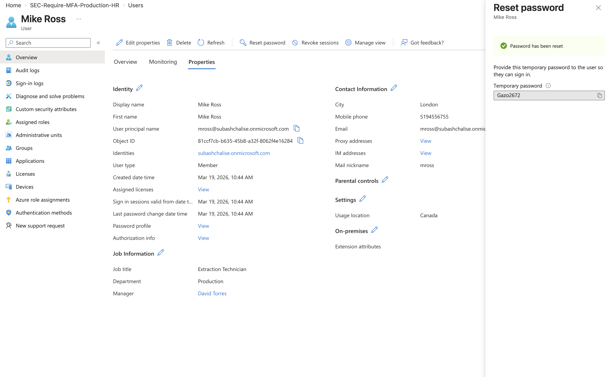
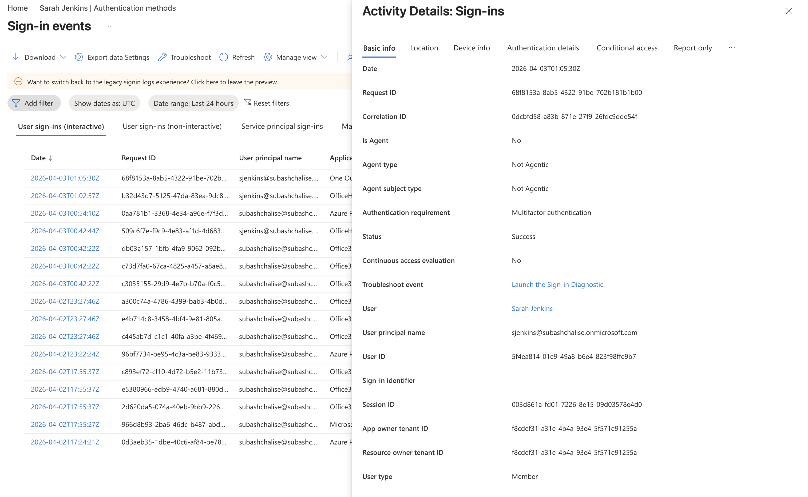

# Entra ID Identity Security Management

## Project Overview
This project simulates a real-world enterprise cloud IT environment, focusing on Identity and Access Management (IAM) within Microsoft Entra ID and the Microsoft 365 Admin Center. Building upon foundational Active Directory lifecycle concepts, this project demonstrates practical cloud administration and aligns with the core identity objectives of the MS-900 (Microsoft 365 Fundamentals) certification.

---
## 📑 Table of Contents
* [Phase 1: Identity Lifecycle & User Onboarding](#phase-1-identity-lifecycle--user-onboarding)
    * [1. User Provisioning & Metadata Management](#1-user-provisioning--metadata-management)
    * [2. Resource Provisioning & Licensing](#2-resource-provisioning--licensing)
    * [3. Role-Based Access Control (RBAC)](#3-role-based-access-control-rbac)
* [Phase 2: Group Management & Delegation](#phase-2-group-management--delegation)
    * [1. Manual Security Groups & Delegation](#1-manual-security-groups--delegation)
    * [2. Dynamic Group Automation](#2-dynamic-group-automation)
* [Phase 3: Security & Conditional Access (MFA)](#phase-3-security--conditional-access-mfa)
    * [1. Targeted MFA Enforcement](#1-targeted-mfa-enforcement-the-ifthen-logic)
    * [2. Security Verification (The User Experience)](#2-security-verification-the-user-experience)
    * [3. Safety & Disaster Recovery](#3-safety--disaster-recovery)
* [Phase 4: Troubleshooting & Operations](#phase-4-troubleshooting--operations)
    * [1. Administrative Password Reset](#1-administrative-password-reset)
    * [2. Investigating Sign-in Logs (The "Detective" Work)](#2-investigating-sign-in-logs-the-detective-work)
* [Conclusion](#conclusion)

---
###  Technologies & Skills
| Category | Tools & Concepts |
| :--- | :--- |
| **Cloud Platform** | Microsoft Entra ID (Azure AD), M365 Admin Center |
| **Security** | Zero Trust, MFA, Conditional Access, Phased Rollout |
| **Identity** | RBAC, Least Privilege, User Lifecycle, Metadata Management |
| **Automation** | Dynamic Security Groups, Attribute-based Access Control (ABAC) |
| **Operations** | Root Cause Analysis (RCA), Sign-in Logs, Password Management |

---

## Phase 1: Identity Lifecycle & User Onboarding

**Objective:** To provision cloud-only identities, configure organizational metadata, apply appropriate licenses, and securely delegate administrative roles.

### 1. User Provisioning & Metadata Management
To establish the organization's foundation, I created multiple cloud-only users divided into distinct departments (IT, HR, Production, Packaging, and Inventory). 

Beyond simply creating the accounts, I ensured each user profile was fully populated with realistic enterprise metadata. This included assigning Employee IDs, physical office locations, job titles, and establishing reporting structures (assigning Managers). Clean data management at this stage is critical for future automation, such as dynamic group memberships.

> **Proof of Execution:** Successfully provisioned a multi-departmental directory, mapping key attributes like Department and Job Title to ensure clean Identity and Access Management (IAM).
> 
>

> **Proof of Execution:** A fully realized user profile demonstrating enterprise-level attention to detail, including reporting structures (Manager assigned) and corporate contact information.
> 

### 2. Resource Provisioning & Licensing
Once the identities were created, the next step was granting them the tools necessary to perform their jobs. For this simulation, I navigated to the Microsoft 365 Admin Center to assign licenses to the Junior Helpdesk user.

I applied two specific licenses:
* **Microsoft 365 Business Basic:** To provide an Exchange mailbox for support tickets and Teams for communication.
* **Entra ID Premium P1:** To unlock enterprise security features required for later phases, such as Conditional Access and dynamic grouping.

> **Proof of Execution:** Successfully navigated the M365 Admin Center to provision productivity applications and advanced security licenses to an end-user.
> 

### 3. Role-Based Access Control (RBAC)
To maintain a secure environment, it is crucial to follow the **Principle of Least Privilege**. Rather than giving the Junior Helpdesk employee full Global Administrator rights, I assigned a specialized built-in role. 

I granted the **Helpdesk Administrator** role. This securely delegates the ability to reset user passwords and troubleshoot sign-in issues without giving the account the power to alter global tenant security settings or delete accounts.

> **Proof of Execution:** Demonstrated understanding of RBAC by securely delegating the Helpdesk Administrator role, ensuring the user has exactly the access needed for their job and nothing more.
> 

---
## Phase 2: Group Management & Delegation

**Objective:** To organize identities for scalable management, demonstrating both manual administrative delegation and automated dynamic memberships to reduce Tier 1 support overhead.

### 1. Manual Security Groups & Delegation
In enterprise environments, access is granted to groups, not individuals. I established a standard Security Group for the Production department (`PRD-Production-Team`). 

To alleviate basic ticket volume from the IT Help Desk, I applied the principle of delegation by assigning the Production Manager as the "Owner" of this group. This empowers the department head to manage their own team's membership without requiring Global Admin intervention.

> **Proof of Execution:** Created a departmental security group and successfully delegated ownership to a non-IT manager.
> 

### 2. Dynamic Group Automation
To demonstrate advanced identity automation, I utilized my Entra ID Premium P1 license to configure a Dynamic Security Group for the Human Resources department (`HR-Human-Resources-Team`). 

Instead of relying on manual additions during onboarding, I built a membership query that automatically evaluates user metadata. If a user's `Department` attribute is set to "Human Resources," they are instantly added to the group. This eliminates human error and guarantees secure, instant access provisioning.

> **Proof of Execution:** Successfully configured a dynamic membership query `(user.department -eq "Human Resources")` to automate group assignments based on user attributes.
> 

---
## Phase 3: Security & Conditional Access (MFA)

**Objective:** To implement a modern Zero Trust security framework by enforcing Multi-Factor Authentication (MFA) through targeted Conditional Access policies, ensuring high-priority accounts are protected without causing tenant-wide disruption.

### 1. Targeted MFA Enforcement (The "If/Then" Logic)
Using the Entra ID Premium P1 features, I moved beyond standard "Per-User MFA" to a more scalable and automated **Conditional Access** approach. I created a custom policy named `SEC-Require-MFA-Production-HR`.

* **Policy Logic:** * **IF** a user belongs to the `PRD-Production-Team` or `HR-Human-Resources-Team` security groups...
    * **AND** they attempt to access **All Cloud Apps** (Outlook, Teams, Azure Portal, etc.)...
    * **THEN** they are **Required to perform Multi-Factor Authentication (MFA)**.
* **Strategic Phased Rollout:** I purposely excluded the Global Admin and other departments (Packaging, Inventory) from this initial policy. This demonstrates a "Phased Rollout" strategy, which is industry best practice to ensure security changes can be validated on a smaller scale before a company-wide enforcement.

> **Proof of Execution:** Successfully configured a live Conditional Access policy with granular targeting, demonstrating an understanding of modern identity security boundaries.
>  

### 2. Security Verification (The User Experience)
A critical step in any security implementation is verification. To ensure the policy was functioning correctly, I performed a "Sign-in Test" using an Incognito browser session.

I attempted to log in as **Sarah Jenkins** (HR Director). Because her account is part of the targeted `HR-Human-Resources-Team` group, Entra ID immediately intercepted the login attempt. The system successfully triggered the "Action Required" screen, forcing the user to register for MFA before granting access to corporate resources.

> **Proof of Execution:** Verified the policy in a real-world login scenario. The "Action Required" prompt confirms the Zero Trust boundary is active and effectively protecting the targeted user accounts.
>  

### 3. Safety & Disaster Recovery
By targeting specific groups rather than selecting "All Users," I ensured that my **Global Administrator** account remained accessible. In a production environment, this strategy prevents "Admin Lockout" scenarios. For future scalability, I would implement **Emergency Access (Break-Glass) accounts** and add them to the "Exclude" tab of this policy to ensure the tenant remains manageable even if the MFA service experiences a global outage.

---

## Phase 4: Troubleshooting & Operations

**Objective:** To demonstrate the ability to support an identity environment through password management and security auditing.

### 1. Administrative Password Reset
I performed a simulated password reset for **Mike Ross** (Production). This demonstrates the standard help-desk workflow for account recovery, ensuring the user is prompted to create a private password upon their next login to maintain security.

> **Proof of Execution:** Successfully managed user account recovery via the Entra ID administrative portal.
>  

### 2. Investigating Sign-in Logs (The "Detective" Work)
In an enterprise environment, a common support ticket is: *"I'm getting blocked by MFA!"* To prove my ability to perform **Root Cause Analysis (RCA)**, I investigated the sign-in logs for **Sarah Jenkins** to verify the state of her authentication attempt.

* **The Investigation:** I navigated to the **Monitoring > Sign-in logs** section and located the specific authentication attempt for the user.
* **The Discovery:** The logs confirmed a **"Success"** status with the **"Authentication requirement"** clearly listed as **Multifactor authentication**. 
* **The Conclusion:** By reviewing the **Conditional Access** tab within the logs, I confirmed that my specific security policy (`SEC-Require-MFA-Production-HR`) was the direct trigger for this challenge. This proves that the user is being correctly protected by the organization's Zero Trust security boundaries and that the system is operating exactly as designed.

> **Proof of Execution:** Used Entra ID monitoring tools to perform a successful security investigation, verifying that the identity protection policies are being applied correctly to the targeted users.
>  

---
## Conclusion

This project successfully establishes a secure, automated, and professionally managed cloud identity environment from the ground up. Through the strategic implementation of **Dynamic Groups**, **Conditional Access**, and **Log Auditing**, I have demonstrated the technical proficiency required to manage a modern enterprise identity lifecycle.

By moving from manual administration to **automated identity governance**, I have significantly reduced the potential for human error while simultaneously strengthening the organization's security posture with a **Zero Trust** architecture. This environment is now fully prepared for scalable growth and robust security monitoring.

---
*Author: Subash Chalise | IT Support Professional*
